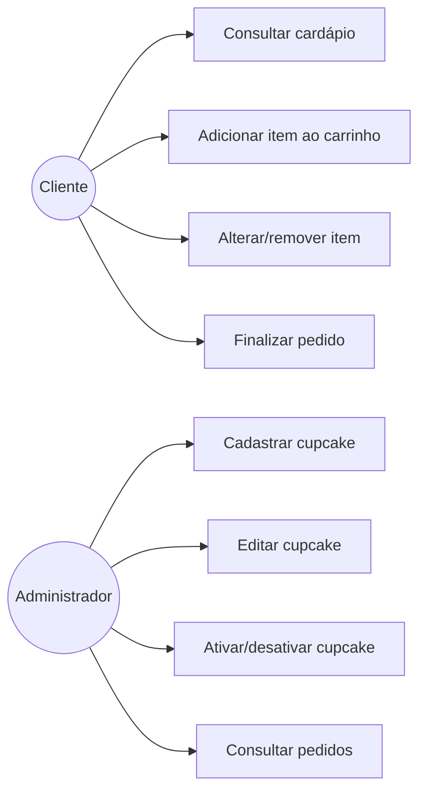
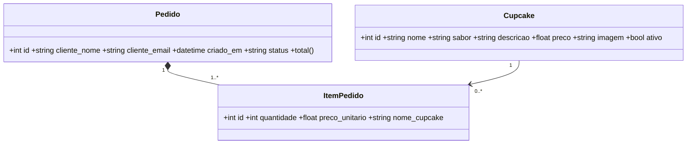
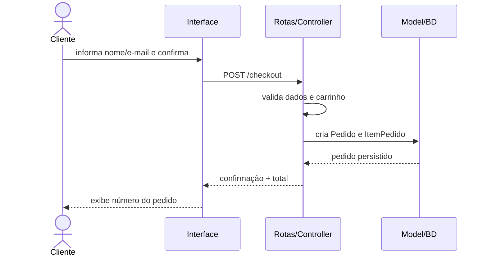
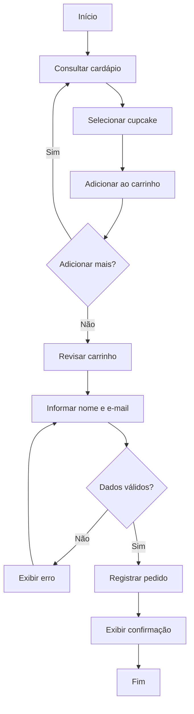

# UML — PIT II Loja de Cupcakes

## Casos de uso

```mermaid
flowchart LR
Cliente((Cliente)) --> A[Consultar cardápio]
Cliente --> B[Adicionar item ao carrinho]
Cliente --> C[Alterar/remover item]
Cliente --> D[Finalizar pedido]
Admin((Administrador)) --> E[Cadastrar cupcake]
Admin --> F[Editar cupcake]
Admin --> G[Ativar/desativar cupcake]
Admin --> H[Consultar pedidos]
```

## Diagrama de classes

```mermaid
classDiagram
class Cupcake { +int id +string nome +string sabor +string descricao +float preco +string imagem +bool ativo }
class Pedido { +int id +string cliente_nome +string cliente_email +datetime criado_em +string status +total() }
class ItemPedido { +int id +int quantidade +float preco_unitario +string nome_cupcake }
Pedido "1" *-- "1..*" ItemPedido
Cupcake "1" --> "0..*" ItemPedido
```

## Sequência — finalizar pedido

```mermaid
sequenceDiagram
actor Cliente
participant View as Interface
participant Controller as Rotas/Controller
participant Model as Model/BD
Cliente->>View: informa nome/e-mail e confirma
View->>Controller: POST /checkout
Controller->>Controller: valida dados e carrinho
Controller->>Model: cria Pedido e ItemPedido
Model-->>Controller: pedido persistido
Controller-->>View: confirmação + total
View-->>Cliente: exibe número do pedido
```

## Atividade — compra

```mermaid
flowchart TD
A[Início] --> B[Consultar cardápio]
B --> C[Selecionar cupcake]
C --> D[Adicionar ao carrinho]
D --> E{Adicionar mais?}
E -- Sim --> B
E -- Não --> F[Revisar carrinho]
F --> G[Informar nome e e-mail]
G --> H{Dados válidos?}
H -- Não --> I[Exibir erro]
I --> G
H -- Sim --> J[Registrar pedido]
J --> K[Exibir confirmação]
K --> L[Fim]
```
